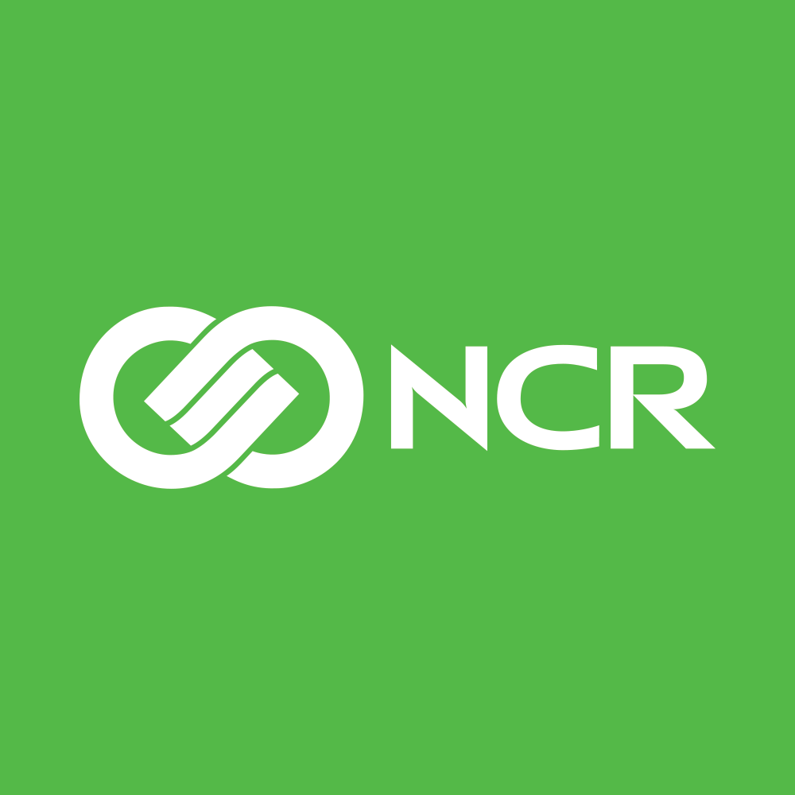
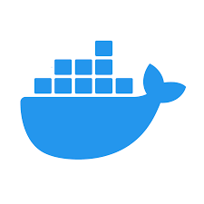

# SmallFund: Powering Small Businesses to Make the Most of their Returns

SmallFund is a platform that allows small businesses to advertise their returned products and increase their chances of making profit on a sold item. A huge problem that small businesses face is not being able to resale returned products which leads to loss of profits and heavy wastage of goods. Using our platform, small businesses will be able to upload pictures of their refunded items with a small description and wholesale them to the public for the chance to make a profit.

## Some of the technologies we used include:

## How it works

Sellers (small businesses) can create a profile on the website to register and login. Once logged into the platform and validated, they can start to create items by uploading an image and providing a name, description, and price of the returned product. Our custom ML algorithm will check if the item is defective based on the image uploaded and determine if it is viable to be uploaded into the database and displayed on the platform for consumers to see. Once it is on the platform, consumers can easily go and buy the item for a lower price and sellers will be notified if their products get sold. 
